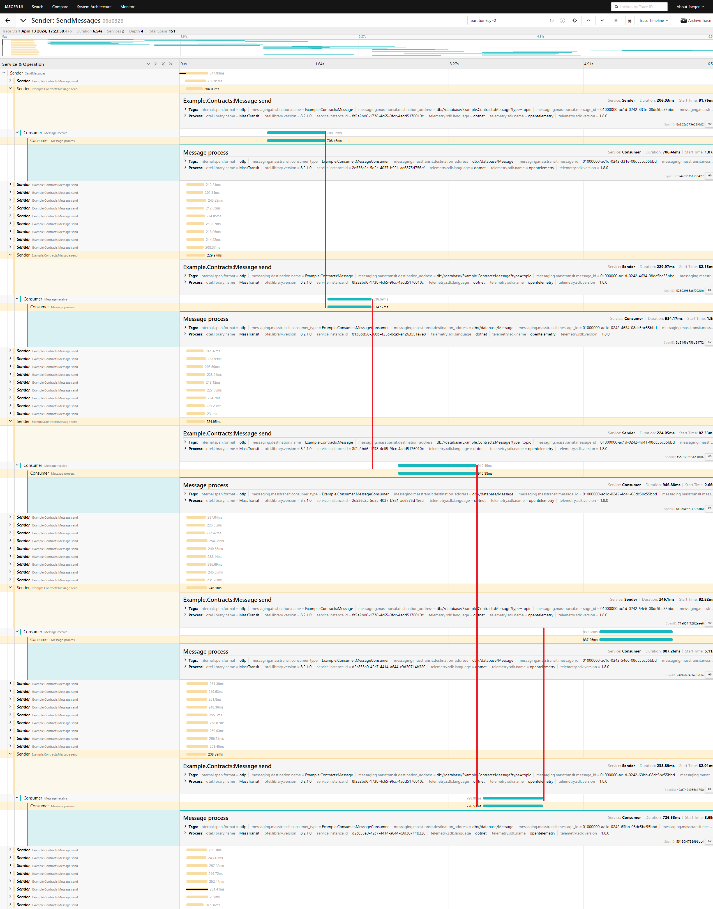
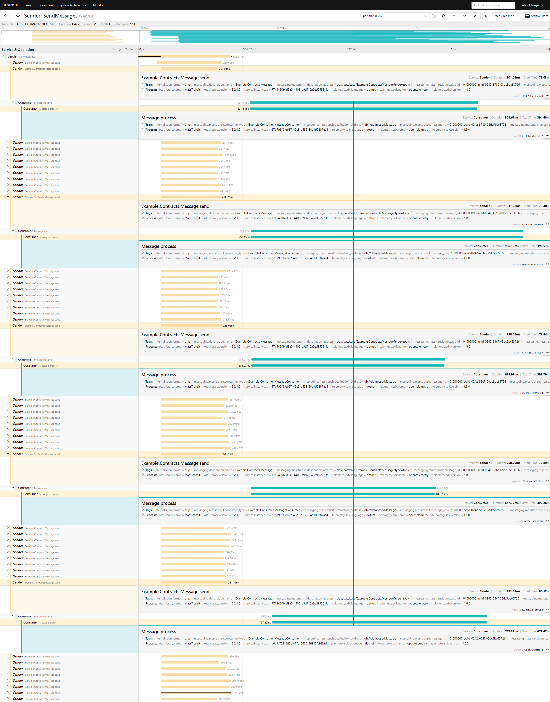

# MassTransit SQL transport example

This repository contains usage examples of the MassTransit SQL transport for parallel processing of partitioned message sequences. The five instances of the Consumer application process incoming messages, while the Sender application generates them according to specified settings. The resulting traces can be viewed in Jaeger.

## Installation and Setup

1. Start **Jaeger** and **PostgreSQL** by running the following command:
    ```
    docker compose up -d jaeger database
    ```
2. Run 5 instances of the **consumer** application by executing:
    ```
    docker compose up --build consumer
    ```
3. Once the consumer's instances are up and running, start the **sender** application by executing:
    ```
    docker compose up --build sender
    ```
4. View the traces in Jaeger at http://localhost:16686/

## Usage Examples

### Example 1: SqlReceiveMode.PartitionedOrdered

This example demonstrates how messages are partitioned based on their partition keys and processed in order, without overlapping.

1. Open `Example.Consumer/Program.cs` and set the receive mode to `SqlReceiveMode.PartitionedOrdered` (line 36). Restart the consumer and sender applications.
2. In Jaeger, select `Sender` in the "Service" dropdown. You will see the "Sender: SendMessages" trace. Click on it for full details. Type `partitionkey=2` in the search field in the navbar and press the locate button.
3. Observe the cyan bars: they do not overlap, indicating that messages in one partition (partition 2 in this case) are processed in order.
  


### Example 2: SqlReceiveMode.Normal

This example demonstrates how messages are processed in parallel, without any partition and order.

1. Open `Example.Consumer/Program.cs` and set the receive mode to `SqlReceiveMode.Normal` (line 36). Restart the consumer and sender applications.
2. In Jaeger, select `Sender` in the "Service" dropdown. You will see the "Sender: SendMessages" trace. Click on it for full details. Type `partitionkey=2` in the search field in the navbar and press the locate button.
4. Observe the cyan bars: they overlap, indicating that messages are processed in parallel without any specific order.
 


## Resetting to Initial State
Reset the environment to its initial state, by executing:
```
docker compose down
```